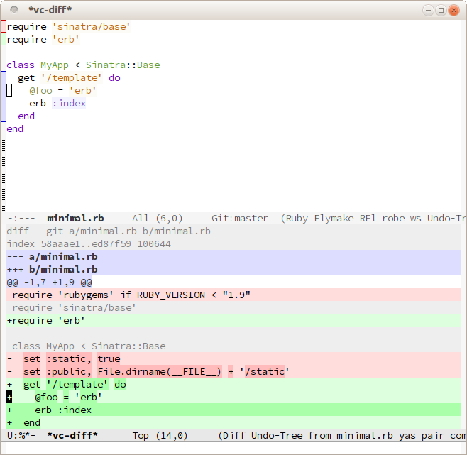
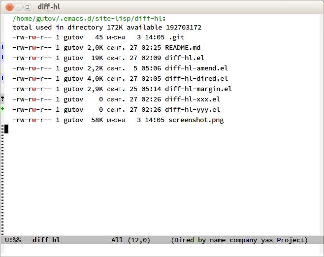
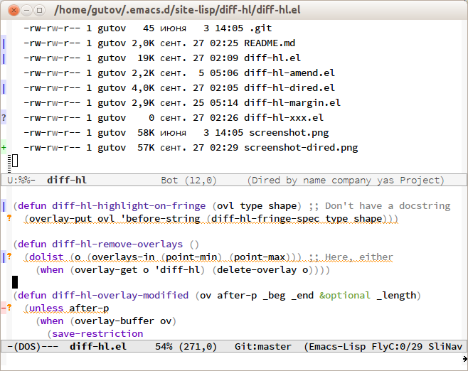

About
=====

`diff-hl-mode` highlights uncommitted changes on the left side of the window,
allows you to jump between and revert them selectively.

For the usage instructions and the list of commands, see the Commentary section
inside the file.

Tested with Git, Mercurial, Bazaar and SVN. May work with other VC backends, too.

The package also contains auxiliary modes:

* `diff-hl-dired-mode` provides similar functionality in Dired.
* `diff-hl-margin-mode` changes the highlighting function to
  use the margin instead of the fringe.
* `diff-hl-amend-mode` shifts the reference revision back by one.
* `diff-hl-flydiff-mode` implements highlighting changes on the fly.
  It requires Emacs 24.4 or newer.

Usage
=====

Put this into your init script:

```lisp
(global-diff-hl-mode)
```

Check out the Commentary section in each file for more detailed usage
instructions.

Screenshots
=====

diff-hl-mode
-----
Top window: a buffer in this minor mode, bottom window: the corresponding diff.



diff-hl-dired-mode
-----



diff-hl-margin-mode
-----



Requirements
=====

Emacs 24.3+.

Notes
=====

* By default `diff-hl-mode` uses the corresponding VC diff command, so
  it's only accurate when the buffer is in saved state. Check out
  `diff-hl-flydiff-mode`, it aims to handle unsaved buffers as well.

* To use an
  [alternative diff algorithm](http://stackoverflow.com/questions/32365271/whats-the-difference-between-git-diff-patience-and-git-diff-histogram)
  with Git, add a corresponding argument to `vc-git-diff-switches`,
  e.g. `(setq vc-git-diff-switches '("--histogram"))`. Using the
  `diff.algorithm` option doesn't work
  [because](http://article.gmane.org/gmane.comp.version-control.git/294622)
  `vc-git-diff` calls `git diff-index`. `diff-hl-flydiff-mode` does
  not support alternative algorithms, because it uses the external
  `diff` program.

* We conflict with other modes when they put indicators on the fringe,
  such as [Flycheck](https://github.com/flycheck/flycheck). This is
  rarely a significant problem, since if you're using such a mode,
  you'd usually want to fix all errors and warnings before continuing,
  and then the conflicting indicators go away.

* There's no fringe when Emacs is running in the console, but the navigation
  and revert commands still work. Consider turning `diff-hl-margin-mode` on,
  to show the indicators in the margin instead.

* Frame-local and buffer-local values of `line-spacing` are not supported.

* Fringe width up to 16 works best (because we can't define a bitmap
  with width above that number).

* [emacs-git-gutter](https://github.com/syohex/emacs-git-gutter) shows
  indicators in the margin by default, allows you to customize how the
  indicators look more easily, and has a "stage hunk" command.

Integration
=====

If you're using some package other than `vc` to commit changes, it might
not run `vc-checkin-hook` after commits. In that case, you'll need to
either add `diff-hl-update` to the hook it does run, or advise some
function that's called in the buffer after its state has changed.

psvn
-----

```lisp
(advice-add 'svn-status-update-modeline :after #'diff-hl-update)
```

Magit
-----

If you're using a version before 2.4.0, it defines `magit-revert-buffer-hook`
(or `magit-not-reverted-hook`), which we use.

When using Magit 2.4 or newer, add this to your init script:

```lisp
(add-hook 'magit-pre-refresh-hook 'diff-hl-magit-pre-refresh)
(add-hook 'magit-post-refresh-hook 'diff-hl-magit-post-refresh)
```
